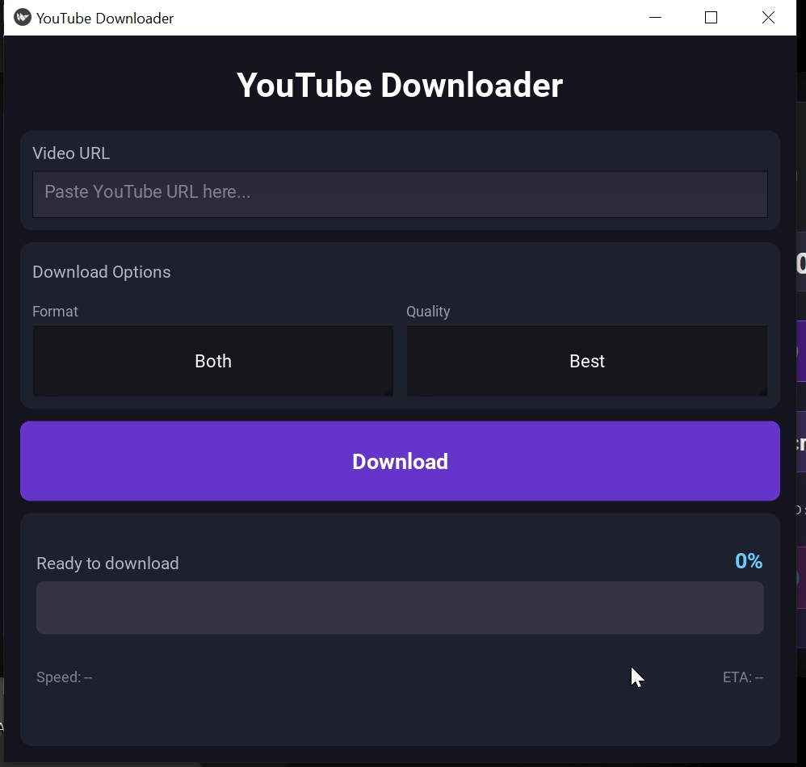

# 📺 Video Downloader for Android


A powerful, open-source Video Downloader for Android built with Python and Kivy. Download videos, audio, or entire playlists in high quality, with seamless FFmpeg integration for merging formats.


**Features:**

*   ✅ **Video & Audio**: Download in 1080p, 720p, or best available quality.
*   ✅ **MP3 Playlist Support**: Download an entire playlist as MP3 audio files with one click.
*   ✅ **Public Gallery Access**: Files are saved to your `Downloads/YouTube-Downloader` folder and appear in your Gallery/Music player.
*   ✅ **FFmpeg Integration**: Built-in FFmpeg/FFprobe binaries for high-quality audio extraction and video merging (MKV/MP4).
*   ✅ **Metadata & Thumbnails**: Automatically embeds metadata and thumbnails into audio files.
*   ✅ **Smart Clipboard**: Auto-pastes links from your clipboard.
*   ✅ **Dark Mode UI**: Sleek, battery-friendly dark interface.

---

## 📸 Preview



### 🎥 Demo Video

[](screenshots/recording.mp4)

---

## 🚀 Installation Guide

### 1. Download the APK

Go to the **[Releases Page](../../releases)** and download the latest `youtube-downloader-vX.X.X.apk`.

### 2. Install on Android

When installing, you might see these warnings:

> [!WARNING]
> **"File might be harmful"**: This is standard for apps downloaded outside the Play Store. Tap **Download anyway**.

> [!CAUTION]
> **"Blocked by Play Protect"**: Since this is a developer build signed with a debug key, Play Protect may block it.
> 1. Tap **More details** (or the arrow).
> 2. Tap **Install anyway**.

### 3. Permissions

On first launch, allow **Storage Permissions** if requested (Android 10+ handles this automatically via Scoped Storage).

---

## 🛠️ How to Build (For Developers)

### Prerequisites

*   GitHub Account
*   Fork this repository

### Automatic Build (GitHub Actions)

1.  Go to the **Actions** tab in your forked repo.
2.  Select **Build Android APK**.
3.  Click **Run workflow**.
4.  Wait ~15 minutes. The APK will appear in the **Artifacts** section of the workflow run.

### Manual Build (Linux/WSL)

```bash
# Install dependencies
sudo apt install -y git zip unzip openjdk-17-jdk python3-pip autoconf libtool pkg-config zlib1g-dev libncurses5-dev libncursesw5-dev libtinfo5 cmake libffi-dev libssl-dev tomsfastmath

# Install Buildozer
pip3 install --user --upgrade buildozer

# Initialize & Build
buildozer init
buildozer android debug
```

---

## 📦 How to Release

To create a formal release with an APK attachment:

1.  Update the version in `buildozer.spec` (e.g., `version = 1.2.0`).
2.  Push your changes.
3.  Create a Git tag and push it:

    ```bash
    git tag v1.2.0
    git push origin v1.2.0
    ```

4.  The GitHub Action will automatically build the APK and create a **Release** drafted with the APK attached.

---

## 📜 License
This project is open-source. Feel free to modify and distribute.
*   Uses `yt-dlp` (Unlicense)
*   Uses `FFmpeg` (LGPL v2.1+)
